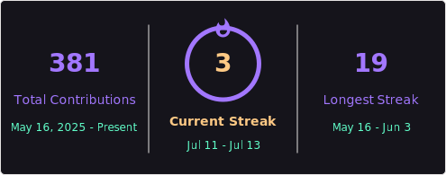

# Hi, I'm Soham Bhattacharya 👋

### Computer Science Engineering Student | Full-Stack & Mobile App Developer

## 💫 About Me

* 🎓 I am pursuing a **B.Tech in Computer Science and Engineering**.
* 🏫 I am currently studying at **Guru Nanak Institute of Technology**.
* 💻 I enjoy building full-stack web applications and mobile applications.
* 🌱 I am passionate about learning new technologies and improving my problem-solving skills.
* 🚀 Currently exploring **MERN Stack, React Native, Android Development, and DevOps**.
* 😊 I love coding and turning ideas into real-world applications.

## 🌐 Connect With Me

## 🚀 Tech Stack

### 💻 Programming Languages

---

### 🎨 Frontend Development

---

### 📱 Mobile App Development

---

### ⚙️ Backend Development

---

### 🗄️ Database & Data Management

---

### ☁️ File Handling & Media Storage

---

### 🚀 Deployment & DevOps

---

### 🛠️ Development Tools

## 📊 GitHub Statistics

 

## ✍️ Random Developer Quote

---

### Thanks for visiting my profile! 😊

