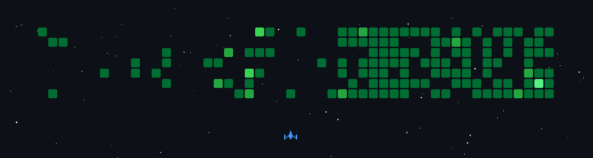

<table width="100%">
<tr>
<td width="64%" valign="middle">

RECRUITER SIGNAL BRIEF · learnerbypassion

<h1>Soham Bhattacharya</h1>
<h2>Frontend or full-stack engineer</h2>

Building useful software and sharing the work in public.

<strong>● Building and sharing work in public</strong>

<a href="https://github.com/learnerbypassion">GitHub</a>

</td>
<td width="36%" valign="middle" align="center">

</td>
</tr>
</table>

<h2>What teams can evaluate quickly</h2>

<table width="100%">
<tr>
<td width="33%" valign="top"><h3>Role fit</h3>
Frontend or full-stack engineer · JavaScript · HTML · CSS
</td>
<td width="33%" valign="top"><h3>Public proof</h3>
34 repositories · 7 stars
</td>
<td width="33%" valign="top"><h3>Momentum</h3>
405 contributions · 131 active days
</td>
</tr>
</table>

Building useful software and sharing the work in public.

<h2>Proof at a glance</h2>

<table width="100%">
<tr>
<td width="25%" align="center"><strong>34</strong> Repositories</td>
<td width="25%" align="center"><strong>7</strong> Stars</td>
<td width="25%" align="center"><strong>405</strong> Contributions</td>
<td width="25%" align="center"><strong>6</strong> Followers</td>
</tr>
</table>

<h2>Selected work</h2>

<table width="100%">
<tr>
<td width="50%" valign="top">
<h3><a href="https://github.com/Learnerbypassion/Employee-Management-System">Employee-Management-System</a></h3>

This is a practice project. I made this while learning React.

JavaScript · ⭐ 3 · 🍴 0

</td>
<td width="50%" valign="top">
<h3><a href="https://github.com/Learnerbypassion/Legal-Guardian">Legal-Guardian</a></h3>

https://legal-guardian.netlify.app

JavaScript · ⭐ 4

</td>
</tr>
<tr>
<td width="50%" valign="top">
<h3><a href="https://github.com/Learnerbypassion/flappyBirds">flappyBirds</a></h3>

A selected public project.

JavaScript · ⭐ 0

</td>
<td width="50%" valign="top">
<h3><a href="https://github.com/Learnerbypassion/SangeetListener">SangeetListener</a></h3>

A selected public project.

JavaScript · ⭐ 0

</td>
</tr>
</table>

<h2>Technical toolkit</h2>

<table width="100%">
<tr>
<td width="20%" align="center"><strong>JavaScript</strong> 80% of public code</td>
<td width="20%" align="center"><strong>HTML</strong> 7% of public code</td>
<td width="20%" align="center"><strong>CSS</strong> 6% of public code</td>
<td width="20%" align="center"><strong>TypeScript</strong> 6% of public code</td>
<td width="20%" align="center"><strong>Dockerfile</strong> 0% of public code</td>
</tr>
</table>

<h2>Consistency signal</h2>

<h2>Space Shooter</h2>

The contribution graph becomes a playable arcade scene. GitHub Actions refreshes the animation daily and commits it straight back into this repository.

<table width="100%">
<tr>
<td width="62%" valign="middle"><h2>Let's talk about the next build</h2>
Open to thoughtful teams, ambitious products, and useful engineering work.
</td>
<td width="38%" valign="middle" align="right"><a href="https://github.com/learnerbypassion">GitHub</a></td>
</tr>
</table>

Soham Bhattacharya · Frontend / full-stack engineer building in public

